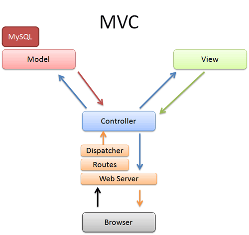

## [Slides](https://docs.google.com/presentation/d/1NMo8xvyYzRipMSpD6BtlpVsVSx3qtKZ5RqubkQVeVpw/edit#slide=id.g3e8c33decc_0_160)

# Intro to Course

## Prework

Complete the prework by the end of week 1 of class. Especially:

1. [GA's Free Dash Tutorial (HTML/CSS)](https://dash.generalassemb.ly/)
1. [Learn CSS in 12 Min](https://www.youtube.com/watch?v=0afZj1G0BIE) (Video - 12 min)
1. [Code Academy JavaScript](https://www.codecademy.com/learn/introduction-to-javascript)
1. [CSS Cross-Country (Only Lesson 1)](https://www.codeschool.com/courses/css-cross-country) (Tutorial - 45min)
1. [Semantic HTML (Videos 2 hrs)](https://www.youtube.com/playlist?list=PLWjCJDeWfDdc0Sp_DinOWnodw3KnWCwc1)

## Intial Objectives 

1. Connect as a class
1. Be able to find and identify the topics and objectives of this course
1. Know why this course and the WEB cycle is designed the way it is

## Initial Exercise

**Intros** - Circle up and share
  1. Your name
  1. Where you're from
  1. Your power animal or superpower

## Overview

This course is the first of the three courses that make up the baseline web development module at the Product College at Make School. This course has three major features, it is:

1. **Paradigm-Based** - Rather than focus on particular language or framework, we try to keep all instruction at the paradigm level. We use JavaScript and Express because these tools are flexible and minimalistic meaning they expose the paradigms you are utilizing.
1. **Project-Based** - While you attend class to gain more competencies and knowledge, there will be projects that you do at your own pace starting with two tutorials and then a final custom project. The final project should be a contribution to your portfolio.
1. **Competency-Based** - each class will have a set of competency-based objectives that I'll review at the beginning of class.

# Request-Response Cycle, Web Servers & Web Frameworks

## Objectives

1. Define **Convention over Configuration**
1. Identify and describe the Request-Response Cycle
1. Identify and describe the Model View Controller convention
1. Define the **Separation of Concerns**

## Overview

For this course, we are going to zoom in on one layer: the server. The server is called a "server" because it serves data to anyone that asks properly. To make servers work, we could write raw, vanilla code, or we can use pre-made **Frameworks**. These frameworks follow standardized conventions. As web developers we have to learn those conventions to save time, and to make our code predictable for other developers. One of the primary conventions is the Model View Controller (MVC) convention.

<<<<<<< HEAD
=======
### Why MVC?

**Think, Pair, Share** - Think up 5 conventions that exist in ordinary day-to-day life. Share your list with a partner. Why do we follow these conventions? What are alternatives? What if we didn't follow them what would happen?

>>>>>>> af440ba520374fbda30b0ac93e08a0db224b58b6
Why do we have architectures like MVC? The answer is because they are conventions that make coding easier.

We could write all the code together in one file without spaces or new lines, the computer does not care, but that would be very hard for humans to work on.

Instead, we break up code into by **Concern** or area of functionality in order to simplify the process of writing web servers. This principle is called the **Separation of Concerns**. Basically "keep code together that do the same thing".

We want to always look for conventions to use, and be careful when we depart from conventions. We want to put **Convention over Configuration** - so that our code is standardized and recognizable by other developers.

## Two Conventions: MVC & The Request-Reponse Cycle

Code is instructions for a computer.

The web is a network of computers with two types of nodes in the network. Clients, that request and display data, and servers that request and respond with data (but do not display it).

Clients and servers request data and servers respond to requests to data using one process called the **Request-Response Cycle**. Examples of clients are browsers, apps, and IoT devices like the Amazon Echo. Examples of servers are any website or web service on the internet.

Servers, who request and respond to data, have various ways that they are organized, but we will be learning the most common pattern called **Model View Controller** or **MVC**.

* **Model** - Where code goes that interfaces with a database.
* **Views** - Where code goes that users see and interact with (HTML).
* **Controllers** - Where code that defines routes, requests, and responses logic goes.

Here is a diagram of an integrated look at the Request-Response Cycle and MVC:

## Resources

1. [Request Response Cycle Code Academy](https://www.codecademy.com/articles/request-response-cycle-static)
1. [What is Programming in MVC](https://www.youtube.com/watch?v=1IsL6g2ixak)
1. [This is what Node.js is used for in 2017 - Survey Results](https://blog.risingstack.com/what-is-node-js-used-for-2017-survey/)

## Baseline Challenges

**CoC & MVC**
1. Work with a partner to come up with an analogy for the request response cycle and MVC and share it on slack.
1. Draw your own original picture of the Request Response Cycle and MVC - your picture can be inspired by your analogy if you like!

**HTML/CSS/JS**
1. Install [Emmet](https://emmet.io/) or another HTML snippet package to your text editor.
1. Prerequisites - if you have not completed all the prerequisites, take the time to do that now and before next class. (Intro to HTML/CSS/JS)
    1. [HTML Semantics (videos)](https://www.youtube.com/playlist?list=PLWjCJDeWfDdc0Sp_DinOWnodw3KnWCwc1)
    1. [Dash Tutorial](https://dash.generalassemb.ly/)
    1. [CSS Cross-Country (Tutorial)](https://www.codeschool.com/courses/css-cross-country)
    1. [Learn CSS in 12 Min (video)](https://www.youtube.com/watch?v=0afZj1G0BIE)
    1. [Code Academy JavaScript lesson (tutorial)](https://www.codecademy.com/learn/javascript)
    
**Project**

1. Begin the [Giphy API Tutorial](https://www.makeschool.com/online-courses/tutorials/giphy-search-app-with-node-js/your-node-environment). You should plan to finish this tutorial by the following Monday.

