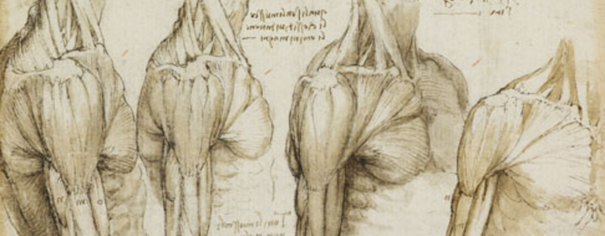

# The DOM, HTML, CSS, JS Events and Listeners

## Objectives

1. List the major characteristics of the Renaissance
1. Define a **polymath** or **multipotentialite**
1. Define the DOM and explain its structure
1. Manipulate the DOM with JS
1. Style the DOM with CSS

## Overview: Leonardo Da Vinci

Leonardo Da Vinci was a Renaissance polymath and multipotentialite. Who made significant contributions to invention, painting, sculpting, architecture, science, music, mathematics, engineering, literature, anatomy, geology, astronomy, botany, writing, history, and cartography. Designed a prototype of a helicopter, painted the Mona Lisa, and made strides in anatomy.

Italy did not exist when he lived, but he lived in what are now Italian cities, Florence, Milan, Rome, Bologna, Venice, and lived the final years of his life in France.

**The Renaissance** - 14-17th centuries, characterized by the rise of humanism and the adoration of classical Greek and Roman culture. Caused by the reemergence of trade, the Crusades, demographic changes from the Black Plague, and cultural conditions of Florence.

**Renaissance People**
* Donatello - ??? 1386 – 13 December 1466
* Leonardo Da Vinci - 15 April 1452 – 2 May 1519
* Michelangelo - 6 March 1475 – 18 February 1564
* Raphael - April 6 1483 – April 6, 1520
* Machiavelli - 3 May 1469 – 21 June 1527
* Shakespeare - 26 April 1564 – 23 April 1616

## Overview: An Analogy for the DOM—The Body

The DOM


## HTML


Each webpage is made up of a tree-like structure of HTML called the **DOM (Document Object Map)**.

So this snippet of HTML has the tree-like DOM structure in the image below.

```HTML
<html>
  <head>
    <title>My Title</title>
  </head>

  <body>
    <a href="#">My Link</a>
    <h1>My header</h1>
  </body>
</html>
```


## JavaScript



## CSS


