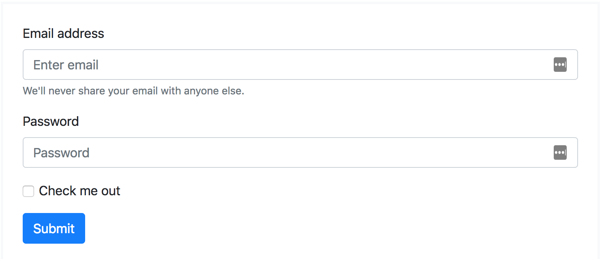

# Bootstrap Basics

1. 5 min Intro & Objectives
1. 30 min Initial activity
1. 20 min TT and Demo on CoC and Bootstrap
1. 10 min Break
1. 30 min Challenges
1. 5 min Wrap up

## Why Master Bootstrap? (5 min)

* Convention over Configuration
* Fast to Build
* Backend Web Developers expected to prototype
* "Design Systems" are popular everywhere, bootstrap is just a public & opensource one

## Objectives (5 min)

1. Add bootstrap to any project.
1. Utilize bootstraps most basic css classes to define a conventional web design
1. Deploying a bootstrap responsive grid, navbar, and forms.

## Overview (5 min)

Remember that Convention over Configuration is a way to gain in development speed, code reusability, and to cope with unexpected edge cases. Well we can use CoC on the front end as well as the back end. We will first be learning how to use Bootstrap to learn the conventions of web design, and then in future classes we will learn how to write completely custom CSS code. For now though, we just need things to look OK.

Much like Picasso who first mastered the traditional painting techniques before launching off to invent modern art.

### Early Picasso


### Late Picasso


## Demo of Bootstrap - Login Page (20 min)

### Defining a Layout with the Responsive Grid

The grid is the most basic and most important concept and use of bootstrap. Using margins, floats, and percentage widths, bootstrap and pretty much all CSS frameworks define a grid, usually with 12 columns.


The grid can be applied to any element so every cell of the grid is its own 12 column grid.

Here is an example of a standard bootstrap grid inside a `container` element (which adds padding to the sides of the page)

```html
<div class="container">
  <div class="row">
    <div class="col-sm-10 col-sm-offset-1">
    </div>
  </div>
</div>
```

The `sm`, `lg`, `xs`, etc in the defining the column classes lets you know that this is a **Responsive Grid**. These prefixes let you know what size screen these classes will respect.

* `xs` - mobile
* `sm` - tablet
* `md` - laptop
* `lg` - desktop
* `xlg` - large desktop

If you wanted certain elements to have a width of 1/3 of an element on a mobile phone in portrait mode you would use the `col-xs-4` class. You can use these classes together to make your projects look good on any sized screen.

Underneath the hood these classe are using the CSS3 `@media` [**media queries**](https://www.w3schools.com/css/css_rwd_mediaqueries.asp).

You can also use other various **helper classes** to control what your site looks like on various screen sizes. `xs-hidden`, `sm-visible`, etc all will do what they say, e.g. `xs-hidden` will hide the element on a mobile phone.

**Reminder** - the responsive grid will not work without this `<meta>` tag in your `<head>` element.

```HTML
<meta name="viewport" content="width=device-width, initial-scale=1">
```

## Navbar

Almost all websites have a navbar over the top of the page. Since it is so conventional. Bootstrap has a responsive navbar you can, and should, use in your projects.

[Bootstrap Navbar](https://getbootstrap.com/docs/4.1/components/navbar/)


## Forms

Bootstrap also provides very nice form and button styling.

[Bootstrap Forms](https://getbootstrap.com/docs/4.1/components/forms/)



```html
Copy
<form>
 <div class="form-group">
   <label for="exampleInputEmail1">Email address</label>
   <input type="email" class="form-control" id="exampleInputEmail1" aria-describedby="emailHelp" placeholder="Enter email">
   <small id="emailHelp" class="form-text text-muted">We'll never share your email with anyone else.</small>
 </div>
 <div class="form-group">
   <label for="exampleInputPassword1">Password</label>
   <input type="password" class="form-control" id="exampleInputPassword1" placeholder="Password">
 </div>
 <div class="form-group form-check">
   <input type="checkbox" class="form-check-input" id="exampleCheck1">
   <label class="form-check-label" for="exampleCheck1">Check me out</label>
 </div>
 <button type="submit" class="btn btn-primary">Submit</button>
</form>
```

## Activity: Recreating Your Wireframes

Many great painters began their careers making deliberate copies of the masterworks of other artists. So we're going to take a chapter from their book.

1. Pick one of your wireframes you drew in last week's.
1. Make an `index.html` file in a new directory called `bootstrap-mockup`.
1. Now add bootstrap using the CDN link

    ```html
    <link rel="stylesheet" href="https://stackpath.bootstrapcdn.com/bootstrap/4.1.3/css/bootstrap.min.css" integrity="sha384-MCw98/SFnGE8fJT3GXwEOngsV7Zt27NXFoaoApmYm81iuXoPkFOJwJ8ERdknLPMO" crossorigin="anonymous">
    ```
1. Now using only bootstrap components make a static HTML/CSS prototype of your wireframe. Do not write any custom CSS, edit colors.
1. For any images, use [placeholder.com](https://placeholder.com/) images.

## Resources

1. [Bootstrap](http://getbootstrap.com/)
1. [Boostrap (videos by Quentin Watt)](https://www.youtube.com/playlist?list=PL41lfR-6DnOovY0t3nBg8Zb6aqm_H70mR)
