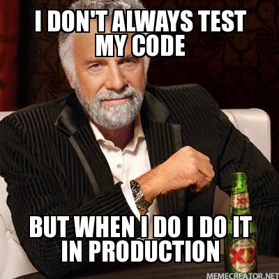

# Environment Strategies, Heroku, and Deployment

## Objectives (5 min)

1. Describe a simple environment and deployment strategy using your local computer and heroku.com
1. Deploy Node/Mongo projects to Heroku
1. Use `dotenv` to protect your keys

## The Production Environment

Any software project has at a few separate **Environments**. Currently we are just using 2 - DEV & PROD.

- **Development (DEV)** on local machines
- **Test (TEST)** on local machines or a separate test server
- **Staging (STAGING)** on a production server (private for stablization and load testing)
- **Production (PROD)** on a production server


Your computer is the host for your development environment.

Heroku will be the host we use for our Production environment. Heroku is a simple turn-key server solution that is free (but requires a credit card). Heroku also provides a rich marketplace of plugins to extend and enhance your server such as monitor bugs, speed, and add databases. We'll be using the "MongoLabs" plugin to add a production mongodb database to our project.

These environments can vary slightly.  Some differences between dev and prod will be what is in the database, or maybe the assets will be compiled, or a dozen other slight differences. As developers we try to keep these environments as similar to each other as possible because differences will make code that ran well in development break in production.



## Activity: Getting Started with Heroku for Node.js (30 min)

1. Follow the instructions in this link [Get started with Heroku for Node](https://devcenter.heroku.com/articles/getting-started-with-nodejs#introduction)

## Activity: Pushing Giphy (10 min)

1. Use `$ heroku create <<PROJECT NAME>>` to create a heroku project for your giphy search app.
1. Push your code to heroku and run `$ heroku open` to open your project. (It should be broken!)
1. Check the logs to see what is wrong `$ heroku logs`.
1. Point your server to listen to your dev and production port.

  ```js
  var port = process.env.PORT || '3000';
  server.listen(port);
  ```

1. Share the link to your giphy search in the BEW tracker.

## Environment Variables in `process.env`

Sometimes you can't save everything into your code files because that would be insecure. For example, if you use a third party service like Amazon Web Services (AWS), then there will be sensitive keys that if you expose to the world on a public Github repo, hackers will steal them and use your codes to rack up hundreds of dollars in fees.

To secure such data, developers use encrypted environment variables that they store locally and in production.

The node package people use to define these variables is called [`dotenv`](https://www.npmjs.com/package/dotenv).

## Activity: Local Environment Variables

1. If you want to use secure local environment variables, add `dotenv` to your project and load it by adding this code to the top of your main server js file. Now your `process.env` in development will contain any variables you define in your `.env` file in the root of your project.

  server.js
  ```js
    if (!process.env.PORT) {
      require('dotenv').config()  
    }
    // Rest of the file
  ```

  .env
  ```
   EMAIL_SECRET=diggitydiggitydog
  ```

  Access the variable
  ```js
    var secret = process.env.EMAIL_SECRET
  ```
